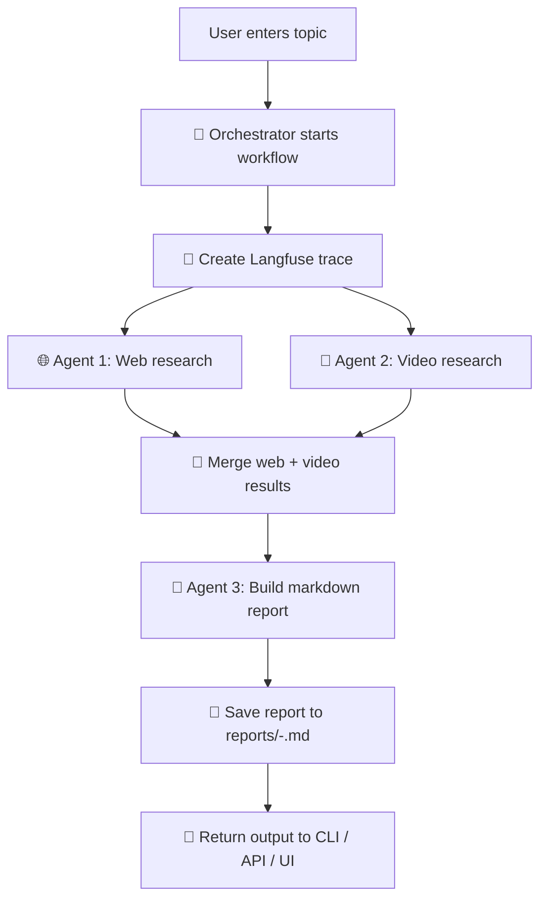
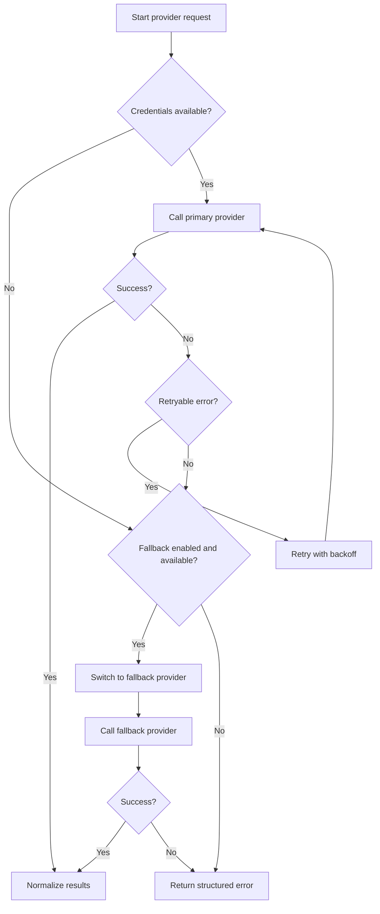
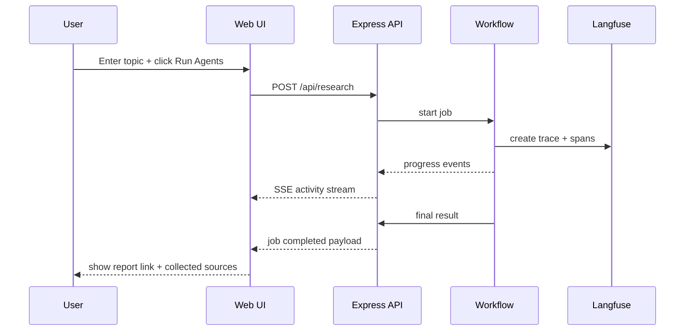

# pilangfuse

A modular **3-agent research system** that collects web sources, YouTube videos, and generates a polished shareable markdown brief for any topic — with **Langfuse tracing**, **retry/fallback logic**, **live progress activity**, **API endpoints**, **browser UI**, and **Docker support**.

---

## Overview

`pilangfuse` orchestrates three specialized agents:

- **Agent 1 · 🌐 Web Research Agent**
  - collects **5 relevant web URLs** for a given topic
- **Agent 2 · 🎥 Video Research Agent**
  - collects **5 relevant YouTube videos** for the same topic
- **Agent 3 · 📝 Report Writer Agent**
  - compiles the findings into a **shareable markdown file** named:
    - `<topic>-<datetime>.md`

Every step can be traced with **Langfuse**, and progress is shown in a professional emoji-rich activity stream in both **CLI** and **Web UI**.

---

## Table of Contents

- [Core Functionality](#core-functionality)
- [Key Features](#key-features)
- [Architecture](#architecture)
- [Visual Flow](#visual-flow)
- [Mermaid Flowcharts](#mermaid-flowcharts)
- [UI Preview Placeholders](#ui-preview-placeholders)
- [Project Structure](#project-structure)
- [How the Agents Work](#how-the-agents-work)
- [Provider Support](#provider-support)
- [Langfuse Tracing](#langfuse-tracing)
- [Progress Activity Format](#progress-activity-format)
- [Installation](#installation)
- [Environment Variables](#environment-variables)
- [Sample Environment Profiles](#sample-environment-profiles)
- [Usage Guide](#usage-guide)
  - [CLI Usage](#cli-usage)
  - [Web UI Usage](#web-ui-usage)
  - [API Usage](#api-usage)
- [Docker Setup](#docker-setup)
- [Output Format](#output-format)
- [Error Handling and Retries](#error-handling-and-retries)
- [Customization Guide](#customization-guide)
- [Example End-to-End Flow](#example-end-to-end-flow)
- [Future Enhancements](#future-enhancements)

---

## Core Functionality

Given a topic such as:

```text
AI agents for software engineering
```

the system will:

1. start a workflow trace
2. run **Agent 1** and **Agent 2** in parallel
3. collect:
   - 5 web resources
   - 5 YouTube videos
4. pass both result sets to **Agent 3**
5. generate a markdown report
6. save the report under `reports/`
7. expose status updates in:
   - terminal logs
   - web UI live activity stream
   - API job events endpoint

---

## Key Features

### 1. Multi-agent workflow
- separate research responsibilities by agent
- better modularity and maintainability
- easier provider replacement and extension

### 2. Langfuse integration
- top-level workflow trace
- per-agent spans
- trace metadata includes runtime context when available

### 3. Live progress activity
- eye-catching professional event feed
- clear emoji-based step labels
- suitable for demos, internal tools, and user-facing workflows

### 4. Retry + timeout support
- automatic retries for transient HTTP issues
- request timeout handling
- clearer operational resilience

### 5. Provider fallback
- switch search providers through env config
- fallback to alternate provider when available

### 6. Optional LLM-enhanced report generation
- use OpenAI to make the markdown more polished
- graceful fallback to deterministic markdown if unavailable or if generation fails

### 7. API + Browser UI
- can be used as a script, service, or internal research dashboard

### 8. Docker-ready deployment
- includes `Dockerfile`
- includes `docker-compose.yml`
- easy local or server deployment

---

## Architecture

The application is split into layers:

### Agents
Responsible for business behavior:
- `webAgent.js`
- `videoAgent.js`
- `reportAgent.js`

### Providers
Responsible for external search integrations:
- `webSearch.js`
- `videoSearch.js`

### Workflow
Responsible for orchestration:
- `runResearch.js`

### Shared libraries
Responsible for config, tracing, retries, logging, and utilities:
- `config.js`
- `http.js`
- `logger.js`
- `langfuse.js`
- `errors.js`
- `utils.js`

### Delivery layers
- `src/index.js` → CLI entry point
- `src/server.js` → API + browser UI host

---

## Visual Flow

### High-level workflow

```text
             ┌──────────────────────────────┐
             │ User provides a topic        │
             │ CLI / API / Web UI           │
             └──────────────┬───────────────┘
                            │
                            ▼
             ┌──────────────────────────────┐
             │ Orchestrator starts workflow │
             │ Langfuse trace created       │
             └──────────────┬───────────────┘
                            │
              ┌─────────────┴─────────────┐
              │                           │
              ▼                           ▼
┌─────────────────────────┐   ┌─────────────────────────┐
│ Agent 1 🌐 Web Research │   │ Agent 2 🎥 Video Search │
│ Collect 5 web URLs      │   │ Collect 5 YouTube links │
└─────────────┬───────────┘   └─────────────┬───────────┘
              │                             │
              └─────────────┬──────────────┘
                            ▼
             ┌──────────────────────────────┐
             │ Agent 3 📝 Report Writer     │
             │ Build markdown brief         │
             │ Save <topic>-<datetime>.md   │
             └──────────────┬───────────────┘
                            │
                            ▼
             ┌──────────────────────────────┐
             │ Result exposed to user       │
             │ CLI / UI / API / file output │
             └──────────────────────────────┘
```

### Detailed execution sequence

```text
User Topic
   │
   ├── 🚀 Orchestrator starts workflow
   ├── 🧬 Langfuse trace opens
   ├── 🌐 Agent 1 starts web search
   │     ├── try primary provider
   │     ├── retry on transient failures
   │     └── fallback provider if enabled
   ├── 🎥 Agent 2 starts video search
   │     ├── try primary provider
   │     ├── retry on transient failures
   │     └── fallback provider if enabled
   ├── 🔗 Results merged
   ├── 📝 Agent 3 writes report
   │     ├── 🤖 optional OpenAI enhancement
   │     └── 🧾 fallback deterministic formatter
   ├── ✅ report saved
   └── 🎉 workflow completed
```

---

## Mermaid Flowcharts

> GitHub renders Mermaid diagrams directly. If your markdown viewer supports Mermaid, the diagrams below will appear as flowcharts.

### 1. End-to-end workflow



### 2. Provider + retry behavior



### 3. Live UI activity flow



---

## UI Preview Placeholders

Until you capture real screenshots or GIFs, the README uses placeholder UI assets.

### Dashboard placeholder


### Live activity placeholder


### Recommended replacements

After running the app, replace the placeholders with actual assets such as:

- `docs/assets/ui-dashboard.png`
- `docs/assets/ui-live-demo.gif`
- `docs/assets/ui-report-output.png`

A helper note is included in:

```text
docs/assets/README.md
```

---

## Project Structure

```text
src/
  agents/
    reportAgent.js
    videoAgent.js
    webAgent.js
  lib/
    config.js
    errors.js
    http.js
    langfuse.js
    logger.js
    utils.js
  providers/
    videoSearch.js
    webSearch.js
  workflow/
    runResearch.js
  index.js
  server.js
public/
  index.html
  app.js
  styles.css
docs/
  assets/
    ui-dashboard-placeholder.svg
    ui-live-activity-placeholder.svg
env/
  .env.tavily-youtube.example
  .env.serpapi.example
reports/
Dockerfile
docker-compose.yml
.env.example
package.json
README.md
```

---

## How the Agents Work

## Agent 1 · 🌐 Web Research Agent

Purpose:
- search the web for the topic
- collect top 5 relevant URLs
- normalize output into a structured format

Output shape:

```json
{
  "index": 1,
  "title": "Example title",
  "url": "https://example.com",
  "brief": "Short summary",
  "score": 0.91,
  "source": "tavily"
}
```

Behavior:
- starts a Langfuse span
- emits progress updates
- uses configured provider
- retries on transient failure
- optionally falls back to alternate provider

---

## Agent 2 · 🎥 Video Research Agent

Purpose:
- search YouTube-related video content for the topic
- collect top 5 video links
- normalize results into a common format

Output shape:

```json
{
  "index": 1,
  "title": "Example video",
  "url": "https://www.youtube.com/watch?v=...",
  "brief": "Short summary",
  "channel": "Example channel",
  "publishedAt": "2026-08-03T09:00:00Z",
  "source": "youtube"
}
```

Behavior:
- starts a Langfuse span
- emits progress updates
- supports retries and fallback

---

## Agent 3 · 📝 Report Writer Agent

Purpose:
- combine web and video results
- create a readable markdown brief
- save it to disk using a timestamped filename

Features:
- deterministic markdown formatter by default
- optional OpenAI enhancement for a more polished shareable summary
- graceful fallback if OpenAI fails

Saved file example:

```text
reports/ai-agents-for-software-engineering-2026-08-03T10-15-00-000Z.md
```

---

## Provider Support

The system supports configurable providers.

### Web search providers
- `tavily`
- `serpapi`

### Video search providers
- `youtube`
- `serpapi`

### Example configuration

```env
WEB_SEARCH_PROVIDER=tavily
VIDEO_SEARCH_PROVIDER=youtube
ALLOW_PROVIDER_FALLBACK=true
```

### Fallback example
If `WEB_SEARCH_PROVIDER=tavily` fails and `SERPAPI_API_KEY` exists, the workflow can automatically switch to `serpapi`.

---

## Langfuse Tracing

Tracing is integrated at workflow and agent level.

### Workflow trace
The application creates a top-level trace for the whole research run.

### Agent spans
The following spans are generated:
- `agent1-web-search`
- `agent2-youtube-search`
- `agent3-report-writer`

### Trace metadata
When available, metadata includes:
- app name
- provider
- model
- pi session id

### If Langfuse credentials are missing
The workflow still runs normally, but tracing is disabled.

---

## Progress Activity Format

The system emits professional step updates with emoji for easier readability.

### Example CLI progress

```text
10:12:01 | 🚀 Orchestrator   | START     | Research workflow started — Topic: AI agents for software engineering
10:12:01 | 🧭 Orchestrator   | RUNNING   | Agents dispatched — Running web and video research in parallel
10:12:02 | 🌐 Agent 1        | RUNNING   | Searching the web — Tavily attempt 1/3
10:12:02 | 🎥 Agent 2        | RUNNING   | Searching YouTube — YouTube API attempt 1/3
10:12:05 | ✅ Agent 1        | SUCCESS   | Web research completed — 5 sources collected
10:12:06 | ✅ Agent 2        | SUCCESS   | Video research completed — 5 videos collected
10:12:07 | 🔗 Orchestrator   | RUNNING   | Research merged — Passing structured findings to report agent
10:12:08 | 📝 Agent 3        | RUNNING   | Report generation started — Building shareable markdown report
10:12:09 | ✅ Agent 3        | SUCCESS   | Report ready — ai-agents-for-software-engineering-2026-08-03T10-12-09-000Z.md
10:12:09 | 🎉 Orchestrator   | SUCCESS   | Workflow completed — /absolute/path/to/report.md
```

### Common emoji meanings
- `🚀` workflow start
- `🧭` orchestration
- `🧬` tracing
- `🌐` web research
- `🎥` video research
- `🔗` merge/hand-off
- `📝` report writing
- `🤖` LLM enhancement
- `🧾` deterministic formatting
- `⚠️` warning/fallback
- `✅` success
- `❌` failure
- `🎉` completed

---

## Installation

### Prerequisites
- Node.js 18+ recommended
- API keys for your chosen providers

### Install dependencies

```bash
npm install
```

### Create environment file

```bash
cp .env.example .env
```

---

## Environment Variables

Default example:

```env
# Output / server
OUTPUT_DIR=reports
PORT=3000

# Providers
WEB_SEARCH_PROVIDER=tavily
VIDEO_SEARCH_PROVIDER=youtube
ALLOW_PROVIDER_FALLBACK=true

# Retry behavior
HTTP_RETRY_COUNT=3
HTTP_RETRY_DELAY_MS=1200
HTTP_TIMEOUT_MS=30000

# Provider keys
TAVILY_API_KEY=
YOUTUBE_API_KEY=
SERPAPI_API_KEY=

# Optional LLM summary
OPENAI_API_KEY=
OPENAI_MODEL=gpt-4.1-mini

# Langfuse
LANGFUSE_PUBLIC_KEY=
LANGFUSE_SECRET_KEY=
LANGFUSE_BASE_URL=https://cloud.langfuse.com
```

### Variable descriptions

| Variable | Purpose |
|---|---|
| `OUTPUT_DIR` | Directory where markdown reports are saved |
| `PORT` | API/UI server port |
| `WEB_SEARCH_PROVIDER` | Web provider: `tavily` or `serpapi` |
| `VIDEO_SEARCH_PROVIDER` | Video provider: `youtube` or `serpapi` |
| `ALLOW_PROVIDER_FALLBACK` | Enables fallback to alternate provider |
| `HTTP_RETRY_COUNT` | Number of retry attempts |
| `HTTP_RETRY_DELAY_MS` | Base backoff delay between attempts |
| `HTTP_TIMEOUT_MS` | Timeout per request |
| `TAVILY_API_KEY` | Tavily API key |
| `YOUTUBE_API_KEY` | YouTube Data API key |
| `SERPAPI_API_KEY` | SerpAPI key |
| `OPENAI_API_KEY` | Optional OpenAI key for richer report generation |
| `OPENAI_MODEL` | LLM model name for report generation |
| `LANGFUSE_PUBLIC_KEY` | Langfuse public key |
| `LANGFUSE_SECRET_KEY` | Langfuse secret key |
| `LANGFUSE_BASE_URL` | Langfuse host URL |

---

## Sample Environment Profiles

Ready-to-copy sample profiles are included in:

```text
env/.env.tavily-youtube.example
env/.env.serpapi.example
```

### Profile 1 · Tavily + YouTube

Use when:
- you want Tavily for web search
- you want the YouTube Data API for video search
- you want provider fallback enabled

Copy example:

```bash
cp env/.env.tavily-youtube.example .env
```

### Profile 2 · SerpAPI for both

Use when:
- you want a single provider for web and video results
- you want simpler credential management
- you prefer no fallback path

Copy example:

```bash
cp env/.env.serpapi.example .env
```

---

## Usage Guide

## CLI Usage

Run the workflow from the terminal:

```bash
npm run research -- "AI agents for software engineering"
```

What happens:
1. workflow starts
2. web and video agents run in parallel
3. report is created
4. absolute file path is printed

Best for:
- automation scripts
- quick research runs
- terminal-first workflows

---

## Web UI Usage

Start the server:

```bash
npm start
```

Then open:

```text
http://localhost:3000
```

### UI flow
1. enter a topic
2. click **🚀 Run Agents**
3. watch live activity cards appear
4. view final collected links
5. open the generated markdown report

The UI shows:
- current job status
- live event timeline
- final output summary
- direct link to the markdown file

Best for:
- demos
- teams
- stakeholder-friendly interaction
- visually tracking the workflow

---

## API Usage

### 1. Start a job

**Request**

```http
POST /api/research
Content-Type: application/json
```

Body:

```json
{
  "topic": "AI agents for software engineering"
}
```

**Response**

```json
{
  "jobId": "<uuid>",
  "status": "queued"
}
```

---

### 2. Get job state

**Request**

```http
GET /api/jobs/:jobId
```

**Response**

```json
{
  "id": "<uuid>",
  "topic": "AI agents for software engineering",
  "status": "completed",
  "createdAt": "2026-08-03T10:00:00.000Z",
  "updatedAt": "2026-08-03T10:00:09.000Z",
  "result": {
    "topic": "AI agents for software engineering",
    "webResults": [],
    "youtubeResults": [],
    "report": {
      "filePath": "/absolute/path/reports/...md",
      "reportUrl": "/reports/...md",
      "markdown": "..."
    }
  },
  "error": null,
  "events": []
}
```

---

### 3. Subscribe to live progress events

**Request**

```http
GET /api/jobs/:jobId/events
```

This endpoint uses **Server-Sent Events (SSE)** and streams job activity in real time.

---

### 4. Health check

```http
GET /api/health
```

---

## Docker Setup

The project includes:

- `Dockerfile`
- `docker-compose.yml`
- `.dockerignore`

### Option A · Build and run with Docker

```bash
docker build -t pilangfuse .
docker run --rm -p 3000:3000 --env-file .env -v "$(pwd)/reports:/app/reports" pilangfuse
```

### Option B · Run with Docker Compose

```bash
docker compose up --build
```

Then open:

```text
http://localhost:3000
```

### Container behavior
- app runs on port `3000`
- reports are persisted to `./reports`
- health check calls `/api/health`

### Recommended workflow

1. copy one of the sample env profiles
2. update keys
3. run with Docker Compose

Example:

```bash
cp env/.env.tavily-youtube.example .env
docker compose up --build
```

---

## Output Format

Generated filename pattern:

```text
<topic>-<datetime>.md
```

Example:

```text
reports/ai-agents-for-software-engineering-2026-08-03T10-15-00-000Z.md
```

### Markdown report includes
- title
- generated time
- executive summary
- 5 web resources with short briefs
- 5 YouTube videos with short briefs
- key takeaways

---

## Error Handling and Retries

The project includes improved reliability features.

### Retry behavior
Automatic retries occur for transient failures such as:
- request timeout
- `429 Too Many Requests`
- `500`, `502`, `503`, `504`

### Better error handling
- structured application errors
- clearer status messages
- provider-specific failure visibility
- fallback behavior when alternate provider credentials exist

### Agent 3 fallback logic
If OpenAI fails or is unavailable:
- the workflow does **not** stop
- deterministic markdown generation is used instead

---

## Customization Guide

### Change web provider

```env
WEB_SEARCH_PROVIDER=serpapi
```

### Change video provider

```env
VIDEO_SEARCH_PROVIDER=serpapi
```

### Disable fallback

```env
ALLOW_PROVIDER_FALLBACK=false
```

### Change output directory

```env
OUTPUT_DIR=custom-reports
```

### Change server port

```env
PORT=8080
```

### Adjust retry behavior

```env
HTTP_RETRY_COUNT=5
HTTP_RETRY_DELAY_MS=1500
HTTP_TIMEOUT_MS=45000
```

### Use OpenAI-enhanced report writing
Add:

```env
OPENAI_API_KEY=your_key_here
OPENAI_MODEL=gpt-4.1-mini
```

---

## Example End-to-End Flow

User input:

```text
Prompt engineering for enterprise support teams
```

Workflow behavior:
- Agent 1 finds 5 relevant articles/pages
- Agent 2 finds 5 related YouTube videos
- Agent 3 creates a markdown brief combining both
- report is stored in `reports/`
- UI and API show progress as the job runs
- Langfuse captures workflow and span traces

Result:
- a ready-to-share markdown file for teammates or stakeholders

---

## Future Enhancements

Potential next upgrades:
- PDF export alongside markdown
- email/slack sharing of final report
- additional providers for web/video search
- persistent database-backed job storage
- authentication for multi-user access
- downloadable ZIP of all sources
- source ranking/scoring improvements
- report templates for different audiences
- batch topic processing
- scheduled research jobs

---

## Quick Start Summary

### Local

```bash
npm install
cp env/.env.tavily-youtube.example .env
# fill keys
npm start
```

### Docker

```bash
cp env/.env.tavily-youtube.example .env
docker compose up --build
```

Then open:

```text
http://localhost:3000
```

Or run directly from CLI:

```bash
npm run research -- "your topic here"
```

---

## Final Notes

This project is designed to be:
- modular
- traceable
- demo-friendly
- production-extensible
- easy to operate from terminal, browser, API, or Docker

If you want next, I can also add:
- persistent job storage
- authentication
- PDF/HTML report export
- Slack/email sharing
- CI pipeline for build and Docker publish
