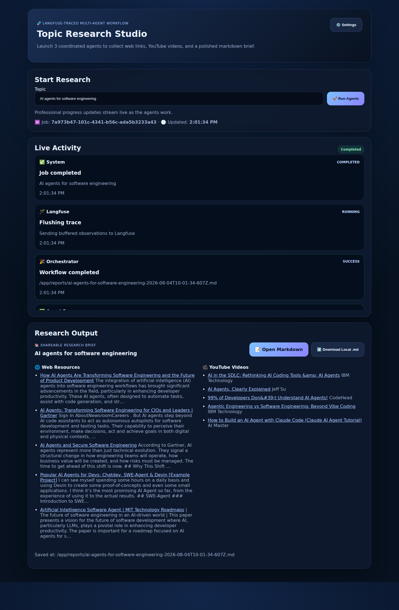
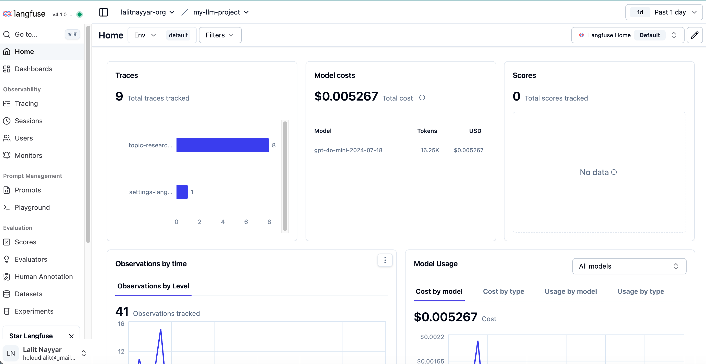
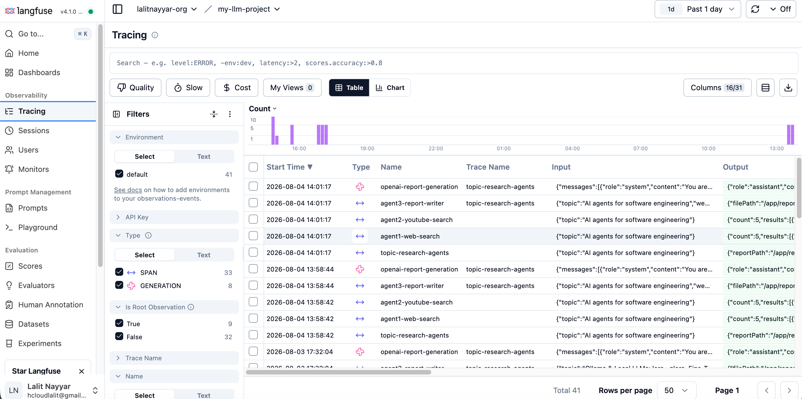
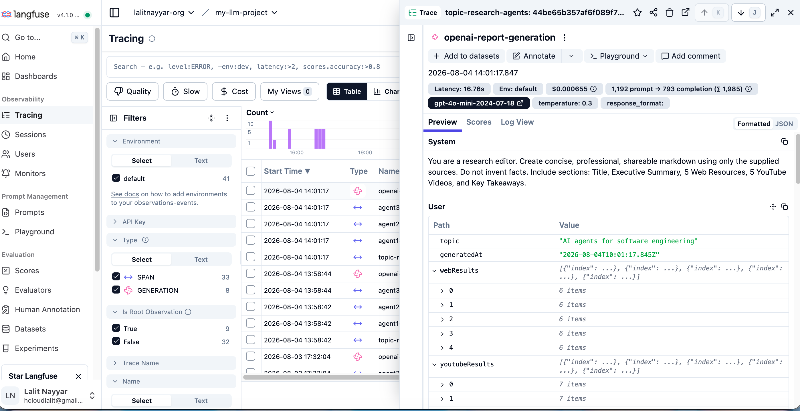

# I didn’t want to build another AI demo. I wanted to build something a team could actually use.

Like a lot of people working in AI, I kept seeing the same pattern.

A demo would look exciting at first:
- enter a prompt
- wait a few seconds
- get a smart-looking answer

And for a moment, it felt like the future.

But the more I thought about real adoption inside teams, the more I felt something was missing.

Because once you move beyond novelty, people start asking better questions:
- Can this handle an actual workflow?
- Can I see what it is doing?
- Can I trust the output?
- Can someone non-technical use it?
- Can this be deployed and improved over time?

Those questions stayed with me.

That is what led me to build **TraceBrief AI**.

---

## The idea behind TraceBrief AI

I wanted to create something that felt closer to a real product than a model demo.

Something that could take a practical task — in this case, topic research — and turn it into a repeatable workflow with visible execution and a usable output.

So TraceBrief AI became a **3-agent research system**:

- a **Web Research Agent** to gather relevant sources
- a **Video Research Agent** to gather YouTube references
- a **Report Writer Agent** to turn those findings into a polished markdown brief

The goal was not just to produce content.
It was to create a workflow that people could understand, trust, and operate.

---

## The product experience I wanted users to feel

*One completed run showing live activity, workflow completion, and the final research brief.*

This screen captures a lot of what I wanted the product to feel like.

Not flashy for the sake of being flashy.
Not overloaded.
Just clear:
- here is the task
- here is the workflow status
- here is what the agents did
- here is the final output

That clarity is important to me.
Because good AI products should reduce uncertainty, not add to it.

---

## Why I cared about observability from the beginning

One of the biggest gaps in AI products is that they often feel like black boxes.

You put something in.
Something comes out.
And when it works, everyone is happy.
But when it fails, slows down, or behaves unpredictably, nobody knows where to look.

That is why I integrated **Langfuse tracing** into TraceBrief AI.

I wanted every run to feel less mysterious.
Not just for developers, but for anyone evaluating whether the workflow was good enough to trust.

Observability changes the conversation.
Instead of saying:

> “Trust us, the agents ran.”

You can say:

> “Here is what happened, step by step.”

That matters a lot if you want AI systems to move beyond experiments.

---

## Seeing the dashboard made the idea feel real

*Project dashboard showing traces, model costs, and observation activity.*

This kind of screen matters more than people think.

It changes the product from something that merely produces output into something that a team can actually monitor.

You can look at it and immediately understand:
- that real traces are being captured
- that model activity has a measurable footprint
- that runs create observable events over time
- that the workflow is not disappearing into a void

For me, that was an important product moment.

It meant the system was not just doing work. It was becoming explainable.

---

## The trace list is where the black box starts to disappear

*Tracing view showing workflow runs, agent spans, generation events, and structured inputs and outputs.*

This screenshot is probably the clearest expression of what I wanted from the product.

Not just “AI happened.”
But:
- this workflow ran at this time
- these steps were executed
- these agent spans were created
- these payloads moved through the system
- these outputs came back

That kind of visibility is incredibly grounding when you are building with multiple agents.

It makes the product easier to debug, easier to improve, and easier to trust.

---

## The trace detail is where learning happens

*Detailed trace view for the report generation step with latency, model configuration, token usage, and source payloads.*

I especially like this view because it shows the part of AI products that often stays hidden.

Here, you can inspect the report generation itself:
- the system instruction
- the user payload
- the selected model
- latency
- token counts
- the structured context passed into the final step

That is not just useful for debugging.
It is useful for product thinking.

When you can see the shape of the work so clearly, you start asking better questions:
- Is this the right prompt structure?
- Are we passing the right context?
- Is the cost justified?
- Can we simplify the workflow?
- Where is quality gained or lost?

That is where iteration becomes much more intentional.

---

## Building for both the user and the operator

Another thing I wanted to avoid was building something that only looked good in a screenshot.

A lot of AI apps are pleasant in the first minute, but difficult to run in practice.

So I paid attention to operational details too:
- in-app settings
- provider controls
- masked API keys
- retry and timeout configuration
- Langfuse connection testing
- Docker-ready deployment

That part is less glamorous, but it is often the difference between:
- a cool prototype
- and a tool a team can really adopt

---

## What I learned while building it

The biggest lesson was this:

**Useful AI products are not just about model intelligence. They are about workflow design.**

A strong AI product needs more than output quality.
It also needs:
- structure
- visibility
- reliability
- a clear user experience
- practical delivery

That is what I tried to put into TraceBrief AI.

Not because research automation is the only use case that matters, but because it is a good example of a broader pattern:

AI becomes much more valuable when it is packaged as a workflow people can actually use.

---

## Why I’m sharing it

I’m sharing TraceBrief AI because I think we need more examples of AI products that bridge the gap between:
- model capability
- and operational usability

We have enough demos.
What we need more of are systems that help teams say:

> “Yes, I can see how this would work in the real world.”

That is the standard I wanted to build toward.

---

## If this resonates with you

If you are building in AI, I think the interesting question is no longer just:

> “What can the model do?”

It is:

> “What workflow can we make trustworthy, useful, and easy to adopt?”

That is the question behind TraceBrief AI.

**Live app:** http://187.124.130.193:8300/  
**Langfuse dashboard:** http://187.124.130.193:3000/project/cmsd0u5i40006qg06kl9wxycv  
**Langfuse traces:** http://187.124.130.193:3000/project/cmsd0u5i40006qg06kl9wxycv/traces

#AI #AIAgents #Langfuse #Observability #FounderStory #ProductBuilding #DeveloperTools
