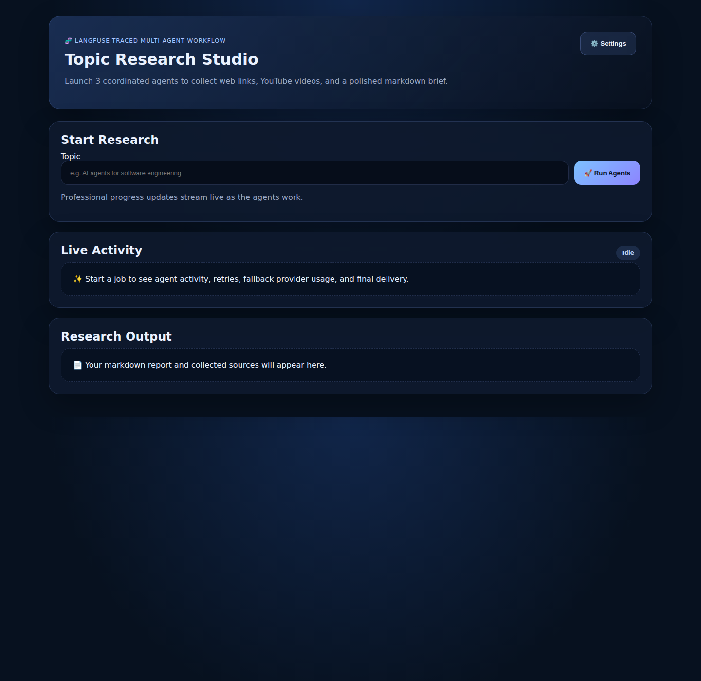
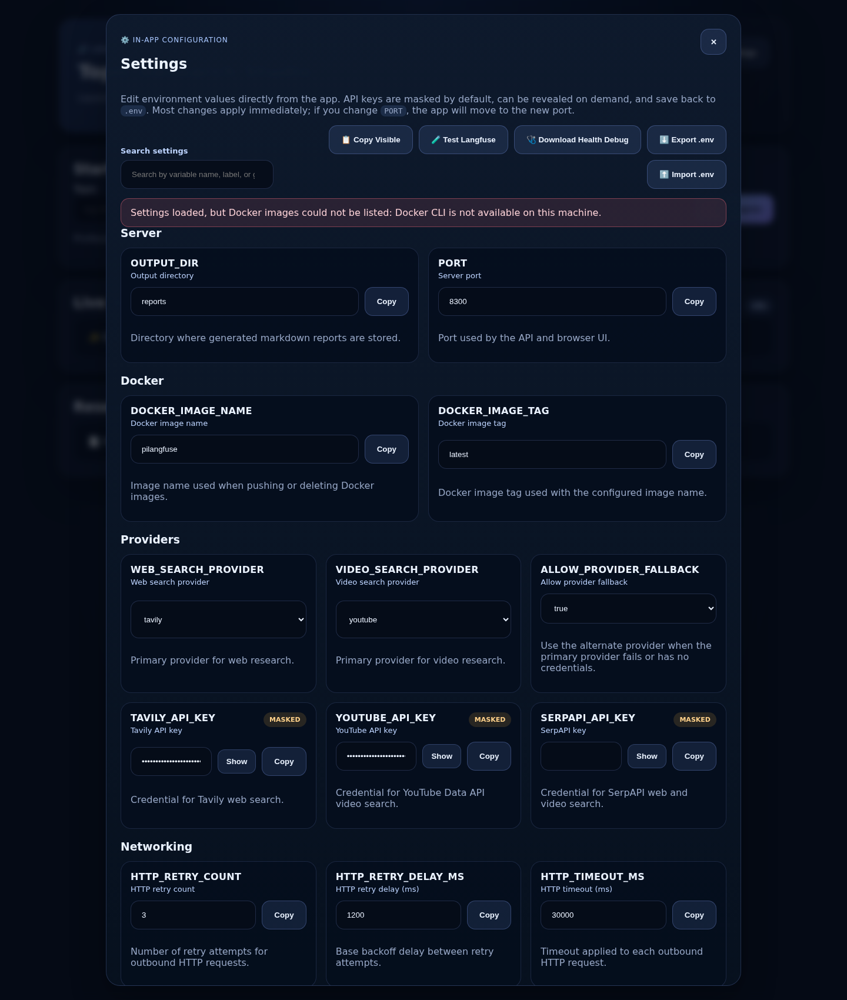

# From prompt demos to buyer-ready AI workflows: why I built pilangfuse

Most AI demos look impressive for 30 seconds.

You enter a prompt, a model responds, and everyone nods.

But the moment a serious buyer asks:
- How does it actually work?
- Can I trust the output?
- Can my team monitor it?
- What happens when one provider fails?
- Can this be used by non-developers?

…most demos fall apart.

That is exactly the gap **pilangfuse** is designed to solve.

**pilangfuse** is a Langfuse-traced, multi-agent research workflow that turns a single topic into:
- curated web research
- relevant YouTube references
- a polished markdown brief
- a live, user-friendly activity stream
- observable execution traces for ops and AI teams

If you are selling AI tooling to product, engineering, research, enablement, or internal ops teams, this is the kind of experience buyers understand immediately.

---

## What the product does

A user enters a topic once.

From there, **three coordinated agents** do the work:

1. **Web Research Agent** collects relevant web sources  
2. **Video Research Agent** collects relevant YouTube videos  
3. **Report Writer Agent** turns the findings into a shareable markdown brief  

The whole workflow is wrapped with:
- **Langfuse tracing**
- **live progress updates**
- **retry and fallback logic**
- **browser UI + API access**
- **Docker-ready deployment**

That means it is not just an AI experiment. It is a **sellable workflow product**.

---

## Why this matters to buyers

Buyers are no longer looking for “one more AI chatbot.”

They want systems that are:
- **task-oriented**
- **observable**
- **repeatable**
- **easy to demo internally**
- **simple for non-technical users to run**

pilangfuse helps teams go from:

> “Let me research this topic for you…”

to

> “Here is a complete workflow that gathers sources, tracks every step, and produces a brief your team can use.”

That shift is what makes the product commercially interesting.

---

## Screenshot 1: live product experience

*Live app: clean entry point for topic-driven research workflows.*

What stands out here is the simplicity.

A business user does not need to understand orchestration, prompts, or tracing infrastructure.
They just enter a topic and run the workflow.

That simplicity is powerful in sales conversations.

---

## Screenshot 2: completed workflow with output

*Example run: live activity timeline, workflow completion, and final research brief in one screen.*

This is where the product gets strong from a buyer perspective.

In one interface, the user can see:
- the job was executed
- the system tracked what happened
- the workflow completed successfully
- web sources were collected
- video references were collected
- a final markdown deliverable was generated

That combination makes the product easy to position for:
- research teams
- developer relations teams
- AI consulting firms
- GTM enablement teams
- internal innovation teams

---

## Screenshot 3: built for operators, not just end users

*Built-in settings management makes the workflow easier to operate, test, and deploy.*

One underrated part of AI product adoption is operations.

It is not enough to generate output. Teams also need to manage:
- provider selection
- API credentials
- retry settings
- timeout controls
- Langfuse connectivity
- deployment configuration

This makes pilangfuse more than a nice demo UI. It becomes a practical internal tool teams can actually run.

---

## Where Langfuse adds real value

A lot of AI products claim “observability.”
Very few make it part of the story buyers can understand.

With Langfuse integrated into the workflow, teams can inspect:
- trace-level execution
- per-agent behavior
- workflow timing
- metadata around runs
- debugging context for failures or slow steps

That matters because AI buyers increasingly ask for governance, reliability, and debuggability before they approve broader rollout.

So the value proposition is not only:

> “We automated research.”

It is also:

> “We can show you exactly how the workflow ran.”

---

## Langfuse references for the article

Use these authenticated links when publishing the final version with observability screenshots:

- **Langfuse traces:** http://187.124.130.193:3000/project/cmsd0u5i40006qg06kl9wxycv/traces
- **Langfuse dashboard:** http://187.124.130.193:3000/project/cmsd0u5i40006qg06kl9wxycv

> Note: from this environment, those URLs currently present a sign-in screen, so I included the live product screenshots above and left these Langfuse links ready for authenticated screenshot replacement if needed.

Suggested caption once Langfuse screenshots are added:

**Langfuse dashboard:** “Operational visibility across runs helps teams trust and improve the workflow.”  
**Langfuse traces:** “Trace-level observability makes multi-agent execution understandable and debuggable.”

---

## Commercial positioning

If I were positioning pilangfuse in market, I would frame it like this:

### 1. AI research copilot for teams
Turn one topic into a structured brief with sources and video references in minutes.

### 2. Multi-agent workflow with buyer-friendly UX
Not a raw backend system. A usable product interface teams can adopt quickly.

### 3. Observable AI for production-minded organizations
Langfuse tracing gives engineering and ops teams the confidence to deploy and improve the workflow.

### 4. Demo-ready and easy to extend
Great for client demos, internal enablement, innovation teams, and AI solution packaging.

---

## Ideal buyers and use cases

pilangfuse is especially relevant for:

- **AI consulting firms** packaging repeatable workflows
- **product teams** researching markets, competitors, or technical topics
- **developer marketing teams** building source-backed content briefs
- **innovation teams** evaluating multi-agent patterns with observability
- **internal knowledge teams** that need fast topic summaries with references

Example use cases:
- competitor landscape research
- technical trend analysis
- content brief generation
- sales enablement research packs
- internal research automation pilots

---

## The bigger message

The future of AI products is not just better prompts.
It is **clear workflows, useful deliverables, and trustworthy observability**.

That is why pilangfuse is interesting.

It shows a practical pattern for moving from:
- isolated model output
- to multi-step execution
- to user-facing results
- to production visibility

And that is exactly the kind of product story that gets attention from real buyers.

---

## Call to action

If you are exploring:
- multi-agent applications
- AI research workflows
- Langfuse-based observability
- internal AI tools your team can actually use

pilangfuse is a strong example of how to package that into something demoable, understandable, and commercially useful.

**Live app:** http://187.124.130.193:8300/  
**Langfuse project:** http://187.124.130.193:3000/project/cmsd0u5i40006qg06kl9wxycv  
**Langfuse traces:** http://187.124.130.193:3000/project/cmsd0u5i40006qg06kl9wxycv/traces

If you want, I can also turn this into:
- a shorter LinkedIn post version
- a founder-style launch post
- a landing page headline/subheadline set
- a sales one-pager
- website copy for the product page
